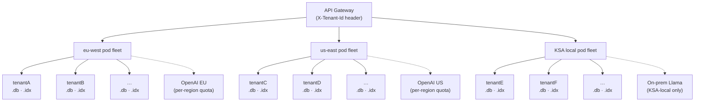

# Multi-Tenant Architectural Extension — Part 4d

> **Scope:** scaling the reference service in `app.py` / `etl.py` to 50 enterprise customers
> with data-residency constraints (EU in eu-west, US in us-east, KSA on local cloud).
> Per the README: this is a written design, not an implementation.

The reference build is single-tenant by construction, but the seams that make it multi-tenant-ready are already in place: an `LlmClient` Protocol, a configurable `DB_PATH` / `INDEX_PATH`, a stateless API layer that reads paths from FastAPI dependencies, and a mtime-keyed FAISS cache that supports atomic swaps. The extension below adds tenant routing on top of those seams without rewriting the core.

---

## Topology

Each tenant gets a private DB file and a private FAISS index. Pods are stateless and route to the right files based on the `X-Tenant-Id` header. Regional pod fleets satisfy residency by physical placement.

---

## 1. Vector-index isolation

**Decision: one FAISS index per tenant, lazy-loaded with an LRU cache.**

Shared indexes with namespace filtering save memory but force every search through a post-filter, which silently degrades top-k recall — if the unfiltered top-k contains nothing from your tenant, the result is empty even though similar data exists in your namespace. Worse, a filter bug is a cross-tenant data leak. The cost of separate indexes is bounded: ~1 MB per 1k orders at 384 dims, so 50 tenants × ~50k orders ≈ 10 GB if all hot at once. In practice usage is skewed; an LRU cache holding the 10 busiest tenants serves >95% of traffic with <2 GB resident.

Cold-start cost is ~50 ms per tenant the first time it's queried after eviction — acceptable because tenant traffic is bursty, and the mtime-keyed cache (`orders/search.py::get_or_load_index`) already does the work. The extension is two lines: key the cache by `(tenant_id, index_path)` instead of just `index_path`, and have the path resolver pull `index_path` from tenant config.

---

## 2. LLM backend per tenant

**Decision: routing lives in the dependency injection layer; the Protocol stays unchanged.**

The reference `LlmClient` Protocol (`orders/llm.py`) already abstracts "thing that turns a question into SQL." Adding `OnPremLlamaLlmClient` and `AzureOpenAiLlmClient` is one file each — they implement the same `generate_sql(question, retry_context)` signature, and `app.py` never knows the difference. The factory `build_client(tenant_config)` becomes a switch on `tenant_config.llm_backend` and runs at request time inside `get_llm_client()`.

Keeping the prompt template **truly** model-agnostic requires one discipline: the system prompt (`orders/prompts.py`) must not depend on OpenAI-specific features. JSON mode is OpenAI-specific, so the `OnPremLlamaLlmClient` ships a JSON-extracting parser instead of relying on a `response_format` field. The reference build already isolates JSON parsing inside `OpenAiLlmClient` — the prompt itself only asks for "JSON matching this schema," which any modern model can satisfy.

Practically: EU and US tenants default to OpenAI (separate API keys per region for residency); KSA defaults to a self-hosted Llama 3 endpoint reached over the local cloud VPC. A few EU/US tenants will demand on-prem too; that's a config flag, not a code change.

---

## 3. PII in the NL→SQL pipeline

**Decision: schema flows freely; questions are scanned for PII patterns; row data never reaches the LLM.**

Three flows touch the LLM:

The schema description (column names + types) is metadata, not data. It can go to any backend without PII concern.

The user's natural-language question may contain customer IDs, dollar amounts, or names depending on what they ask. We add a pre-LLM filter that redacts patterns matching `C\d+`, currency amounts, and obvious names to `<CUSTOMER_ID>` etc., and pass a redaction map alongside so the generated SQL can be re-hydrated server-side. This is acceptable to a cloud LLM and unnecessary on-prem.

Row data from the SQL result **never** goes back to the LLM. The reference build's rule-based answer formatter (`orders/ask.py::_format_answer`) was a deliberate choice partly for cost — but it's also the right PII story. A "let the LLM summarize the results" second call would push real customer data to a third party; we refuse to do that.

The answer changes for on-prem LLMs: redaction can be skipped, and we can adopt a second call that summarizes the result rows in natural language. Tenants who want richer answers can choose on-prem at the cost of running their own GPU.

---

## 4. Highest-leverage decision and accepted trade-off

The decision: **per-tenant filesystem separation for both the SQLite DB and the FAISS index.**

Why it's highest-leverage: it sets the pattern for every other subsystem. Once tenant boundaries are filesystem boundaries, audit, backup, restore, deletion (GDPR right-to-be-forgotten), and residency all reduce to file operations the OS already does well. The API layer never needs a `WHERE tenant_id = ?` clause; the LLM never sees another tenant's schema; the FAISS cache can't accidentally serve another tenant's vectors. Reasoning about correctness collapses from "did every query include the tenant filter" to "is the path resolver correct."

The trade-off accepted: **higher steady-state cost than a shared backend**, both in storage (50× the SQLite overhead) and in memory ceiling (the LRU cache must be sized for the busy-tenant working set). For 50 enterprise customers this is a few hundred dollars a month of disk and one extra-large pod per region. We give up the option of cross-tenant analytics (e.g., "what's our average order across all customers?") — but that's exactly the question multi-tenant SaaS should never answer in this design anyway.
